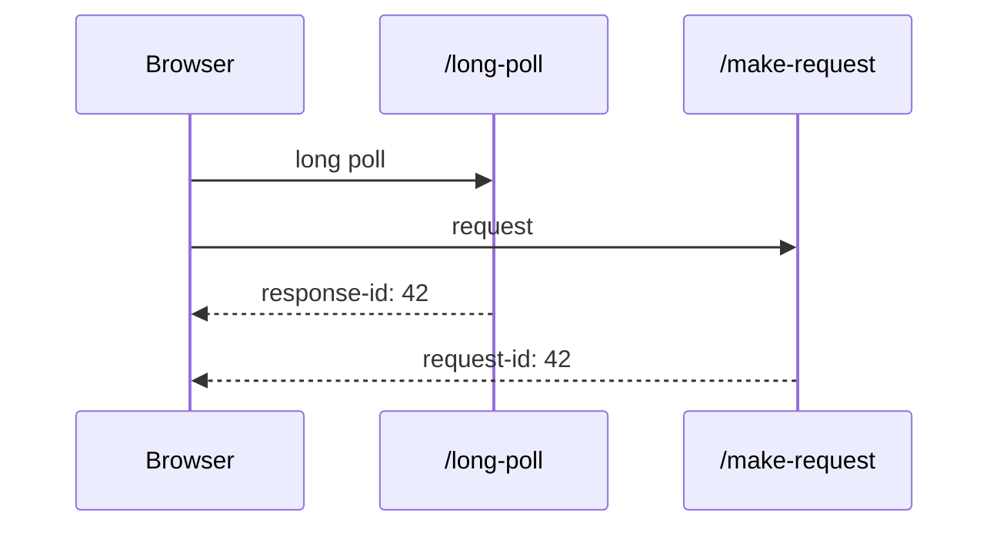

Hi, my name is Igor and I'm going to tell you a story about the very first task I completed in a commercial SWE setting.

I was a lil baby, full of hope and wonder.  Eager to be productive and getting paid the big bucks.

"You're working as part of an outstaffing team for Product Co.
We're porting this control panel from native C++ UI to the new shiny thing named HTML+JavaScript.
A developer from the Product Co. has already implemented the full REST backend for the project.  We have the graphical design.
Your goal is to implement the Web UI per design and make it work with the backend.  K does the QA for the project.  Any questions?"  
"Sounds great.  Can I talk to the backend guy?"  
"He's currently on vacation for two weeks."  
"API docs?  Server available?"  
"Don't worry about that, you can start implementing the UI, and integrate later."  
"There's too much uncertainty here."  
Doesn't sound too reassuring.  I had a suspicion at the moment that working with the backend might be an issue, but I didn't expect the sheer scale of the catastrophe.

Over the next two weeks, I bootstrapped the project, implemented the one screen of UI which was provided, wrote some simple mocks for a fictional data schema that I thought of.  Gave it to QA to poke around,  mentioned that all data is fake.  
"I've implemented the screen I was provided in UI only, but I am uncertain about the integration."  
"What's the problem?  Can't you just integrate the backend?"  
"When I was told to paint the fence, I thought at least there would be a fence.
I've been working using a completely fictional API and schema, and I've yet to see the backend, documentation, or any pieces of real data.  I've not even spoken to the backend developer yet."  
"He's getting back from the vacation tomorrow."  
"OK, great, I'm going to talk to him then."  

(Tomorrow)

"Hey V, hello there.  Hope you had a good vacation."  
"Hi.  Yeah, it's been quite busy."  
"I'm working on Web UI here, and this Web UI is supposed to talk to the RESTful backend.  So, could you tell me how to use it?"  
"Oh yeah, it's super easy, barely an inconvenience!
You just make `POST` requests to the endpoint and then get the responses."  
"What's the list of endpoints?  Do you have API docs? Swagger?  How does authorization work?"  
"There's one endpoint.  To log in, you `POST` your login data, and the (other backend) connection is persistent."  
\[Oh no.\] "What?  Persistent how?  How did you test the server?"  
"You'll see, the web server is running over this `IP:port`.
I'll send you login credentials later."  

So I spent the entire day making requests to the server, and there is good news and bad news.  
The good news is that the server was responding.  
The bad news is that all of the responses were exactly the same.  Regardless of request format, endpoint path, payload, headers and anything I could vary.

Here's the full response, annotated:

```
HTTP/1.1 200 OK  # the request was valid, and I'm gonna give you a response
Content-Type: application/json  # I promise the response body is valid JSON


# ^that was the end of the response, the body is empty
```

There are a few reasons why this is concerning:
First of all, an empty string is not valid JSON, OK?
Second, if all the responses are exactly the same, regardless of the request, it means you can't know if you're succeeding or failing, and the most likely answer is that you're always failing.

So I bring it up with V.

"Hey, I tried using your 'REST' backend, and I failed to get any meaningful response from it whatsoever."  
"What's the issue?"  
"Let's start with the simple one, which is the server always returns `HTTP/200` with an empty response, when `content-type: application/json`."  
"What's the problem with that?"  
"For starters, an empty string is not valid JSON, but more importantly-"  
"What would be a minimal valid JSON?"  
"... what?  The simplest valid JSON response would be an empty dict or an empty array, but you're missing the point, which is-"  
"OK, I'll change the backend to return an empty array."  
"You're missing the point.  I couldn't find a way to get any meaningful response.  How do I get *any* information out of the server?"  
"OH, that's super easy!  You just long-poll a *different* endpoint to get the responses to all the requests you make."  
\[WHAT THE FUCK?!\] "You call this REST?"  
"Yeah, what's the issue?  REST is more like a set of guidelines, it's not strict or anything."  
"One of the main principles of REST is being stateless AND responding to requests with proper responses.  This thing is extremely stateful, it always gives you empty responses.  But also it's unusable!  How do I know which response corresponds to which request?  How do you distinguish different clients?"  
"Oooooh, I didn't think about matching corresponding requests and responses.  Yeah, I guess we'll have to add request-response IDs to the API."  
\[... please for the sake of my sanity, stop.\]

At this point, I thought "I need an adult", but there were none in the room.  So I walk into my manager's office.

"Hey, so about this backend integration... I tried to work with the backend, I think the API as it stands is completely unusable.  I don't think it's possible to work with, and I need a second opinion."  
"What's the problem?  Can't you just integrate the backend?  The server is REST and it should make the integration easy."  
"You can call this API many things, but REST it is not.  As it stands, I don't think it's even *technically* possible to integrate with this API, even if I wanted to.  Can I consult with someone more senior?" \[and hopefully throw this entire thing into the trash fire\]  
"We'll look into that.  Meanwhile, continue working on the integration."  
\[unamused\] "😒"

At this point, my main concern is that I'm a relatively new developer, so I don't even know if what I'm experiencing is *normal*.  I can't really trash talk the existing code because I don't know what quality is *expected*, what is *allowed*, and how much people are going to listen to- or trust me.
Talking to the developer didn't reassure me that the issues are even *understood*.
Bringing up the issues with my direct manager didn't seem to yield any action.
I didn't have any friends technical enough that I could consult them.

The only thing going through my head is "Holy shit, this is the worst API I've seen.  And I've seen quite a lot of bad PHP."

After exhausting all other options, begrudgingly, I started integrating this API into the UI.  The main difficulty at the moment was the double-async + stateful nature of the protocol.
What made things worse, we had to be compatible with Interne Explorer 8, so `Promise` was out.  Oh, and bringing third-party JS libraries was not allowed.  And also I was not allowed to implement `Promise` myself. ([I did it later anyway](https://gist.github.com/m1el/2ada9eaedf7b0815f4e8b9973561c5d6))

With those constraints, lack of knowledge, lack of tools, weird-ass doubly async API, I wrote the worst JS code of my life.  But hey, it finally worked.  For some definition of worked...

How does it address the two questions I had to the developer?  Let's test!

How do I know which response corresponds to which request?  Well, lucky me, when I make a request I get a response: `{"request_id": 42}`, and the long-poll endpoint responds with `{"request_id": 42, ...payload}`.
No big deal, we're going to have a global dict which stores callbacks for specific request ids.  And when we get a corresponding response, the function gets called.

Except I get an error: `"unknown request_id: 42, no matching callback"`.  What?  I clearly see in the network tab that the server does respond with `{"request_id": 42}` to the request, and the long-poll endpoint responds with `{"request_id": 42, ...payload}`...

And it turns out that the long-poll endpoint responds *before* the endpoint that makes the request!  So I was getting a response *before* I registered the callback for that specific ID.



Imagine getting in a hospital line, being told to get the ticket.
You press the button to get the ticket.  Someone says "Number 42! Number 42! Come to the counter!".
Eventually the machine prints the ticket number 42.
Do you *expect* the events to happen in that order?
But anyway, I cussed under my breath, and wrote some code to handle that.

How do you distinguish different clients?  Now truly, unless the web server does some magic, there's no information which would allo it to distinguish different clients.  And then we'd be screwed, because then the integration is literally impossible.  Then I open \[dramatic music\] the *second tab*.
Now, what do you think is going to happen?

- A. Magic.  The server magically figures out the way to respond to the matching tabs.
- B. Fanout.  Both tabs will get the responses from their siblings, at least allowing you to extract the useful info.
- C. Finders keepers.  Whoever gets the message, gets the message.
- D. Mystery box.

I make a request in the first tab... and I get no response.  No response in the second tab either.  Curious.  And the server no longer responds.  Turns out, opening two browser tabs segfaults the server.

So yeah, this is why I grew wary of "just integrate X".

"That was a good story, diving deep enough in technical parts, showing initiative and communication.  However, when you tell a story it's better if you end on a positive note", the sales lady told me.
"Oh, I was *just* getting to the positive note to this story.  After two months or so, someone finally reviewed the C++ web server.  The entire server was trashed immediately.  The review was so scorching that the guy who wrote it got re-evaluated and promptly fired."  
\[Speechless stickguy\] "☝️... 😐"  

## Root Cause Analysis / Lessons learned

- The biggest contributor is the process.  The architecture of the web server was not reviewed for *months* of active development.  I brought up the issue of the web server being terrible immediately, and there was nobody to verify the claim.
- No, you shouldn't "integrate the thing" before the thing exists.  
  Or if the contract does not exist.  You can't dig a tunnel from two ends without a proper plan.
- Since then I trust my own judgment much more. If my brain screams at me that something is not right, I'm going to stop and investigate.  
- No, the person who built it doesn't know better if they can't explain it.
- After this project I'm way more chill about technical challenges & terrible APIs.
